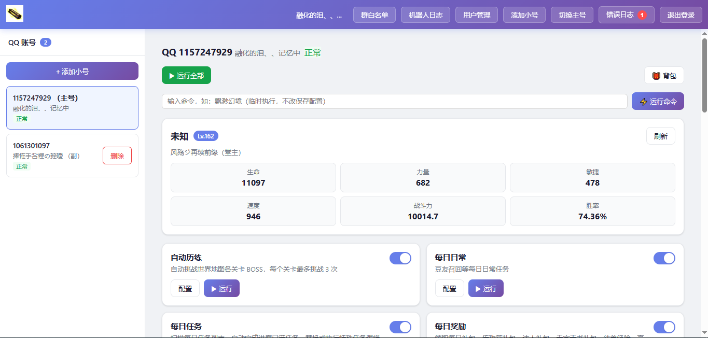

# QQ 大乐斗助手

> ⚠️ **原项目已暂停维护，现已迁移至全新平台**

QQ 大乐斗自动任务系统 - 基于 Node.js 的 Web 自动化工具，支持扫码登录、每日任务、乐斗好友等功能。

> 🎯 **全新在线平台**
> - 平台访问地址：**http://42.192.23.134:3000/**
> - Bug反馈 & 功能需求提交：**https://qcdld.com/**
>
> > 👉 下方为新平台界面预览
>
> 
>

## 重要说明
1. **旧版本仓库项目不再迭代更新，所有新功能、问题修复全部在新平台完成**
2. 旧版本地项目代码仅作学习参考，建议直接使用在线平台，无需本地部署环境
3. 遇到bug、想要新增任务模块，前往 qcdld.com 提交反馈

## 功能特性

### 核心功能
- **扫码登录** - 支持 QQ 扫码登录，自动保存 Cookie
- **定时任务** - 支持自定义定时执行任务，可配置多个执行时间点
- **执行日志** - 记录所有任务执行结果
- **Web 界面** - 浏览器访问操作，无需命令行
- **任务配置** - 支持跳过、替换、自动匹配模块等灵活配置

### 任务模块

| 模块 ID | 名称 | 说明 | 分类 |
|--------|------|------|------|
| `dailygift` | 每日奖励 | 领取每日礼包、传功符礼包、达人礼包、无字天书礼包 | 每日任务 |
| `friendfight` | 乐斗好友 | 乐斗好友/帮友/侠侣，体力不足自动使用药水 | 好友 |
| `store` | 背包管理 | 扫描背包物品、查看道具详情、设置供奉物品 | 查询功能 |
| `wulin` | 武林大会 | 自动随机报名武林大会 | 每日任务 |
| `tenlottery` | 邪神秘宝 | 每日免费抽奖（高级秘宝 24h、极品秘宝 96h） | 每日任务 |
| `knightfight` | 笑傲群侠 | 自动随机报名笑傲群侠 | 每日任务 |
| `towerfight` | 斗神塔 | 斗神塔挑战，支持自动冲塔到 100 层，自动分享 10 倍数层奖励 | 日常活动 |
| `callbackrecall` | 豆油召回 | 随机召回 3 位好友，邀请回来玩吧 | 好友 |
| `adventure` | 历练 | 在世界场景中进行历练战斗，获取经验和阅历 | 历练 |
| `task` | 日常任务 | 自动完成日常任务，根据配置执行模块或替换任务 | 每日任务 |
| `zodiac` | 天界十二宫 | 扫荡天界十二宫副本，不需要活力，有次数限制 | 副本 |
| `jianghudream` | 江湖长梦 | 江湖长梦副本挑战，自动领取首通奖励，检查开放时间后开启副本 | 副本 |
| `cargo` | 镖行天下 | 自动拦截镖车、智能护送押镖 | 每日任务 |
| `faction` | 帮派 | 帮派供奉守护神、完成帮派任务 | - |
| `misty` | 缥缈幻境 | 挑战缥缈幻境关卡，获取奖励 | 挑战 |
| `formation` | 阵法 | 阵法扫描与配置 | - |
| `worldtree` | 世界树 | 世界树功能：福宝一键领取经验奖励、源宝树免费温养 | 每日任务 |
| `spacerelic` | 时空遗迹 | 时空遗迹探索 | - |
| `scrolldungeon` | 画卷迷踪 | 挑战画卷迷踪关卡，自动战斗到最高层 | 活动 |
| `sect` | 门派 | 查看门派信息、五花堂任务、金顶挑战、八叶堂训练、万年寺上香 | 门派 |
| `dragonphoenix` | 龙凰之境 | 龙凰之境：龙凰论武、龙凰云集、龙吟破阵、凰鸣百锻 | 挑战 |
| `knightisland` | 侠客岛 | 侠客岛：群侠名册、侠客行任务、风月宝鉴配饰 | 每日任务 |
| `abysstide` | 深渊之潮 | 深渊秘境副本挑战（8 难度可选、自动兑换次数、智能复活），帮派巡礼赠礼领取 | 每日任务 |
| `peakfight` | 巅峰之战 | 巅峰之战报名与挑战 | 挑战 |
| `ascendheaven` | 登天之路 | 登天之路报名（支持单排/匹配/双排模式，天赋激活） | 挑战 |
| `enchant` | 附魔 | 附魔系统操作 | 系统 |
| `altar` | 祭坛 | 祭坛供奉与奖励领取 | 每日任务 |
| `wish` | 许愿 | 许愿系统操作 | 每日任务 |
| `immortals` | 神仙 | 神仙系统功能 | 系统 |
| `livenessgift` | 活跃度礼包 | 活跃度礼包领取 | 每日任务 |
| `missionassign` | 任务指派 | 任务指派系统 | 系统 |
| `friendinfo` | 好友信息 | 查看好友详细信息 | 查询功能 |

## 快速开始
> 💡 **推荐优先使用在线平台，无需本地部署**
> 访问：http://42.192.23.134:3000/

### 本地旧版环境要求（仅用于学习）
- Node.js 16+
- Chrome 或 Edge 浏览器（用于扫码登录）

### 本地旧版安装

```bash
# 安装依赖
npm install

# 启动服务
npm start

# 停止服务 (Windows)
npm run stop
